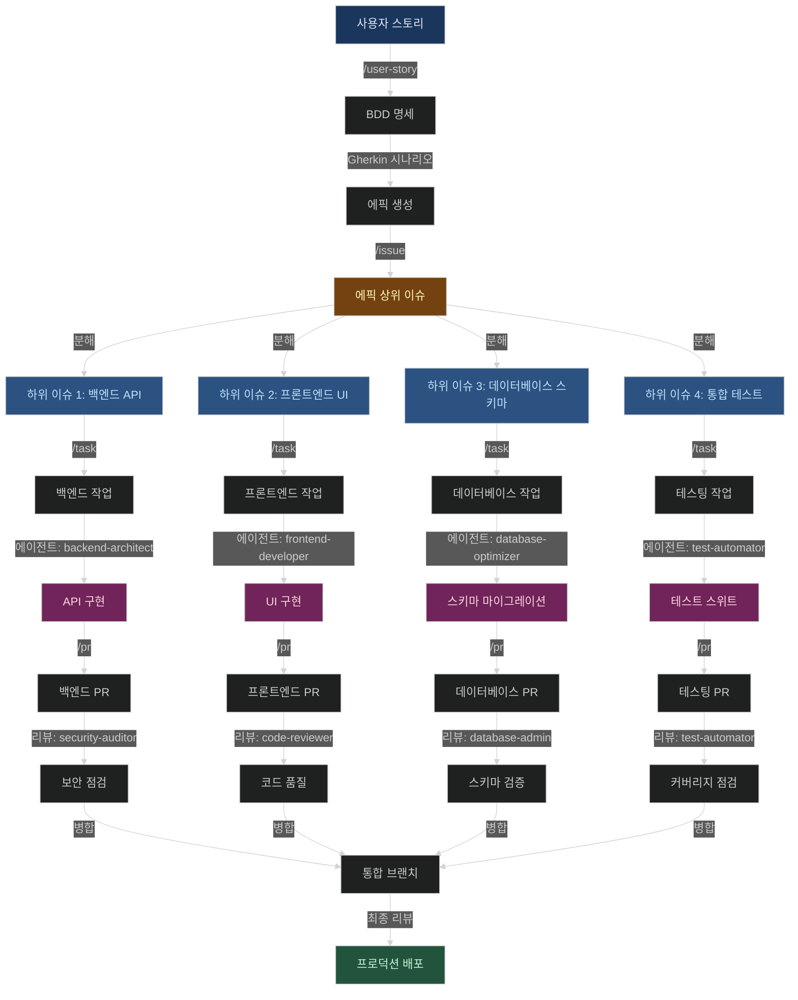

# Claude Code 설정

36개의 특화된 AI 에이전트, 슬래시 명령, GitHub 워크플로우 자동화, 멀티 에이전트 오케스트레이션 패턴을 포함한 개인 Claude Code 설정 디렉토리입니다.

## 목차

- [개요](#개요)
- [기능](#기능)
  - [특화된 AI 에이전트](#-특화된-ai-에이전트)
  - [슬래시 명령](#-슬래시-명령)
  - [멀티 에이전트 오케스트레이션](#-멀티-에이전트-오케스트레이션-패턴)
  - [일반적인 워크플로우 패턴](#-일반적인-워크플로우-패턴)
- [디렉토리 구조](#디렉토리-구조)
- [빠른 시작](#빠른-시작)
  - [설치](#설치)
  - [기본 사용법](#기본-사용법)
- [명령 예시](#명령-예시)
  - [GitHub 워크플로우](#github-워크플로우-명령)
  - [리서치 및 콘텐츠](#리서치--콘텐츠-명령)
- [에이전트 선택 가이드](#에이전트-선택-가이드)
- [모범 사례](#모범-사례)
- [리소스](#리소스)

## 개요

이 저장소는 Claude Code를 다음과 같이 확장합니다:
- **36개의 특화된 AI 에이전트**: 도메인별 전문성을 위한 Haiku/Sonnet/Opus 모델 계층
- **7개 슬래시 명령**: GitHub 워크플로우, 리서치 자동화, 콘텐츠 생성용
- **멀티 에이전트 오케스트레이션**: 복잡한 개발 워크플로우를 위한 패턴
- **GitHub 템플릿**: 이슈, PR, 사용자 스토리 템플릿

## 기능

### 🤖 특화된 AI 에이전트

에이전트는 작업 복잡도에 따라 Claude 모델 계층(Haiku/Sonnet/Opus)에 최적화되어 있으며, 다음 분야를 다룹니다:

- **아키텍처 및 설계**: 시스템 설계, 클라우드 인프라, API 아키텍처
- **프로그래밍 언어**: 시스템, 웹, 엔터프라이즈, 모바일 개발을 위한 언어별 전문가
- **인프라 및 운영**: DevOps, 데이터베이스 관리, 네트워킹
- **보안 및 품질**: 코드 리뷰, 보안 감사, 테스팅, 성능 엔지니어링
- **AI/ML 및 데이터**: LLM 애플리케이션, ML 파이프라인, 데이터 분석
- **문서 및 비즈니스**: 기술 문서 작성, 법무, HR, 마케팅

**📖 다음 내용은 [`agents/README.md`](agents/README.md) 참조:**
- 전체 에이전트 카탈로그 및 기능
- 모델 분배 및 선택 가이드
- 에이전트 오케스트레이션 패턴
- 사용 예시 및 모범 사례

### 💬 슬래시 명령

자동화 및 워크플로우를 위한 명령 템플릿:

| 명령 | 카테고리 | 설명 | 사용 예시 |
|------|----------|------|-----------|
| `/user-story` | GitHub | Gherkin 문법으로 BDD 사용자 스토리 명세 생성 (프로젝트 연결 없음) | `/user-story` (대화형 프롬프트) |
| `/issue` | GitHub | 하위 이슈 분해, 마일스톤/프로젝트 연결, 의존성 그래프 포함 이슈 생성 | `/issue "사용자 인증 기능 추가"` |
| `/task` | GitHub | 하위 이슈를 위한 작업 관리 및 워크플로우 조정 | `/task` (대화형 작업 선택) |
| `/todos` | 내부 | 고급 할일 추적 (Claude Code 내부 사용, 직접 호출 아님) | 내부 사용 전용 |
| `/pr` | GitHub | 템플릿 감지 및 컨벤션 분석이 포함된 포괄적 풀 리퀘스트 생성 | `/pr` (현재 브랜치 분석) |
| `/prompt` | 콘텐츠 | 고급 프롬프트 엔지니어링 기법으로 효과적인 프롬프트 생성 | `/prompt task="API 문서 생성" format="markdown"` |
| `/gh-sync` | GitHub | GitHub 메타데이터 동기화 (마일스톤, 프로젝트, 라벨 등) | `/gh-sync` |

#### 명령 상세

**GitHub 워크플로우:**
- **`/issue`** - 다음을 포함한 포괄적 이슈 생성:
  - 복잡한 기능을 위한 하위 이슈 분해
  - 마일스톤 연결 및 프로젝트 로드맵 (Start/End Date)
  - 팀 및 에이전트 배정
  - 의존성 그래프 (Mermaid 다이어그램)
  - 스토리 포인트 추정 (피보나치 척도)
  - 저장소 컨벤션 분석

- **`/pr`** - 다음을 포함한 풀 리퀘스트 생성:
  - 템플릿 감지 및 적용
  - 최근 PR 컨벤션 분석
  - 변경 유형 분류
  - 리스크 평가 및 테스트 증거
  - 자동 제목 및 라벨 제안

- **`/user-story`** - BDD 사용자 스토리 명세 생성:
  - Gherkin 시나리오 문법 (Given/When/Then)
  - 인수 조건 및 시맨틱 버저닝 지원
  - 프로젝트/마일스톤 연결 없음 (명세 전용)
  - 생성 후 `/issue`로 분해하여 로드맵 연결

- **`/task`** - 다음을 포함한 작업 관리:
  - 하위 이슈에서 대화형 작업 선택
  - 에이전트 배정 및 조정
  - 진행 상황 추적 통합
  - 하위 이슈 컨텍스트 관리

- **`/todos`** - 내부 추적 시스템:
  - Claude Code에 의해 자동 사용
  - 직접 호출용 아님
  - 내부 상태 및 진행 관리

**리서치 및 콘텐츠:**
- **`/prompt`** - 프롬프트 엔지니어링 어시스턴트:
  - 고급 프롬프팅 기법
  - 청중 및 스타일 커스터마이징
  - 형식 지정
  - 체인 오브 쏘트(Chain-of-thought) 및 구조화된 출력

**유틸리티:**
- **`/task`** - 작업 조정 및 관리 인터페이스

### 🔄 멀티 에이전트 오케스트레이션 패턴

#### 순차 처리
에이전트가 컨텍스트를 전달하며 순차적으로 실행:
```
backend-architect → frontend-developer → test-automator → security-auditor
```

#### 병렬 실행
여러 에이전트가 서로 다른 측면에서 동시 작업:
```
performance-engineer + database-optimizer → 병합된 분석
```

#### 검증 파이프라인
주요 작업 후 특화된 리뷰:
```
payment-integration → security-auditor → 검증된 구현
```

#### 조건부 라우팅
분석 기반 동적 에이전트 선택:
```
debugger → [backend-architect | frontend-developer | devops-troubleshooter]
```

#### Worktree 기반 병렬 작업
멀티 에이전트가 동시에 작업할 때 브랜치 충돌을 방지하기 위해 git worktree 사용:

```bash
# 프로젝트 루트 기준 ../.worktrees/ 에 작업 공간 생성
git worktree add -b feat/123-auth ../.worktrees/feat-123-auth origin/main
git worktree add -b feat/124-ui ../.worktrees/feat-124-ui origin/main
git worktree add -b feat/125-db ../.worktrees/feat-125-db origin/main

# 각 에이전트는 독립된 worktree에서 작업
# Agent 1: ../.worktrees/feat-123-auth/
# Agent 2: ../.worktrees/feat-124-ui/
# Agent 3: ../.worktrees/feat-125-db/

# 작업 완료 후 정리
git worktree remove ../.worktrees/feat-123-auth
```

**구조:**
```
WORK/
├── imprun-semu-ai/          # 메인 작업공간 (main 브랜치)
└── .worktrees/              # 병렬 작업용 worktree
    ├── feat-123-auth/       # 에이전트 1 작업공간
    ├── feat-124-ui/         # 에이전트 2 작업공간
    └── feat-125-db/         # 에이전트 3 작업공간
```

### 📋 GitHub 에픽/작업 워크플로우

에이전트 오케스트레이션을 사용한 에픽(상위 이슈)/작업(하위 이슈) 접근 방식으로 사용자 스토리부터 배포까지의 전체 워크플로우:



**워크플로우 분석:**

1. **사용자 스토리 단계** (`/user-story`)
   - Gherkin 시나리오로 BDD 명세 생성
   - 인수 조건 정의
   - 시맨틱 버전 목표 설정
   - 프로젝트/마일스톤 연결 없음 (명세 문서)

2. **에픽 생성 단계** (`/issue`)
   - 저장소 컨벤션 분석
   - 특화를 위한 가용 스킬 검토
   - 다음을 포함한 하위 이슈로 분해:
     - 명확한 범위 경계
     - 의존성 매핑
     - 에이전트/팀 배정
     - 스토리 포인트 추정 (피보나치)
   - 마일스톤 연결 및 프로젝트 로드맵 설정
   - Start Date / End Date 자동 계산 (size 라벨 기반)
   - Mermaid 의존성 그래프 생성 (다크테마 적용)
   - 작업 분류 테이블이 포함된 상위 이슈(에픽) 생성

3. **작업 배분 단계** (`/task`)
   - 각 하위 이슈가 독립 작업이 됨
   - `/task` 명령이 작업 배정 및 추적 관리
   - 특화 에이전트 배정:
     - `backend-architect` → API 설계 및 구현
     - `frontend-developer` → UI 컴포넌트 및 상태
     - `database-optimizer` → 스키마 및 쿼리
     - `test-automator` → 테스트 커버리지 및 자동화
   - Claude Code가 내부적으로 진행 추적
   - 컨텍스트 격리: 각 에이전트가 독립적으로 작업

4. **구현 단계** (에이전트 오케스트레이션)
   - 에이전트가 배정된 하위 이슈에서 병렬 작업
   - 제한된 컨텍스트로 토큰 오버플로우 방지
   - 각 에이전트가 특정 도메인에 집중
   - 통합 인터페이스 사전 정의

5. **풀 리퀘스트 단계** (`/pr`)
   - 각 하위 이슈가 별도 PR 생성
   - 템플릿 감지 및 컨벤션 분석
   - 변경 분류 및 리스크 평가
   - 테스트 증거 및 검증

6. **리뷰 단계** (검증 에이전트)
   - `security-auditor` → 보안 취약점
   - `code-reviewer` → 코드 품질 및 패턴
   - `database-admin` → 스키마 무결성
   - `performance-engineer` → 성능 영향

7. **통합 및 배포**
   - 검증된 PR 병합
   - 최종 통합 테스트
   - 프로덕션 배포

**주요 이점:**

- **명세와 실행 분리**: User Story → Issue로 명확한 역할 구분
- **컨텍스트 관리**: 하위 이슈가 토큰 사용량을 관리 가능하게 유지
- **병렬 작업**: 여러 에이전트가 동시 작업
- **명확한 의존성**: Mermaid 그래프가 통합 지점 표시
- **품질 게이트**: 각 PR이 전문 리뷰를 받음
- **진행 추적**: 프로젝트 로드맵에서 타임라인 일정 관리
- **전문화**: 각 컴포넌트에 적합한 전문가 배정

**예시 명령 시퀀스:**

```bash
# 1. 사용자 스토리 생성
/user-story
# 대화형: 기능명, 페르소나, 목표, 시나리오
# 출력: BDD 명세가 포함된 GitHub 이슈

# 2. 하위 이슈가 포함된 에픽 생성
/issue "사용자 인증 시스템 추가"
# 출력: 에픽 #123 + 하위 이슈 #124, #125, #126, #127
# 에픽 포함: 작업 분류 테이블, 의존성 그래프, 스토리 포인트
# 마일스톤 연결 + 프로젝트 로드맵 (Start/End Date)

# 3. 하위 이슈 #124를 작업으로 관리
/task
# 하위 이슈 #124 선택 (백엔드 API)
# backend-architect 에이전트에 배정
# 구현 진행 추적
# (Claude Code가 내부 할일 자동 관리)

# 4. 하위 이슈 #124 작업 (백엔드 API)
"backend-architect를 사용하여 이슈 #124의 인증 엔드포인트 구현"
# 에이전트가 집중된 컨텍스트로 구현
# 리뷰, 테스트, 검증

# 5. 하위 이슈 #124용 PR 생성
/pr
# #124에 연결된 PR 생성
# 포함: 변경 요약, 테스트 계획, 증거
# 트리거: 리뷰를 위한 security-auditor

# 6. 하위 이슈 #125를 작업으로 관리
/task
# 하위 이슈 #125 선택 (프론트엔드 UI)
# frontend-developer 에이전트에 배정

# 7. 하위 이슈 #125 작업 (프론트엔드 UI)
"frontend-developer를 사용하여 이슈 #125의 인증 UI 구축"
# 에이전트가 UI 컴포넌트 구현
# 리뷰, 테스트, 검증

# 8. 하위 이슈 #125용 PR 생성
/pr
# #125에 연결된 PR 생성
# 트리거: 리뷰를 위한 code-reviewer

# 9. 나머지 하위 이슈 #126, #127 반복
# 각 하위 이슈 따름: /task → 구현 → /pr

# 10. 통합 단계
# 모든 PR이 통합 브랜치에 병합
# 최종 검증 및 배포

# 참고: Claude Code가 내부적으로 할일 및 진행 추적
# 수동 할일 관리 불필요
```

### 📋 일반적인 워크플로우 패턴

**기능 개발**
```
"사용자 인증 구현"
→ backend-architect → frontend-developer → test-automator → security-auditor
```

**성능 최적화**
```
"결제 프로세스 최적화"
→ performance-engineer → database-optimizer → frontend-developer → code-reviewer
```

**프로덕션 장애**
```
"높은 메모리 사용량 디버그"
→ incident-responder → devops-troubleshooter → error-detective → performance-engineer
```

**인프라 구축**
```
"재해 복구 설정"
→ cloud-architect → database-admin → terraform-specialist → observability-engineer
```

**ML 파이프라인 개발**
```
"모니터링이 포함된 ML 파이프라인 구축"
→ mlops-engineer → ml-engineer → data-engineer → performance-engineer → observability-engineer
```

**보안 강화**
```
"보안 모범 사례 구현"
→ security-auditor → backend-security-coder → frontend-security-coder → code-reviewer
```

**API 개발**
```
"문서가 포함된 RESTful API 생성"
→ backend-architect → api-documenter → test-automator → security-auditor
```

### 🎯 GitHub 워크플로우 자동화

#### 이슈 생성 (`commands/issue.md`)
포괄적 다단계 워크플로우:
1. **저장소 분석**: 컨벤션, 템플릿, 기여 가이드라인 검토
2. **모범 사례 조사**: 이슈 작성의 현재 표준
3. **이슈 분류**: 유형, 우선순위, 복잡도 결정
4. **분해**: 복잡한 기능을 배정 가능한 하위 이슈로 분해
5. **의존성 매핑**: 의존성 그래프 및 통합 지점 생성
6. **품질 보증**: 완전성 및 정렬 검증

**기능:**
- 저장소에서 자동 템플릿 감지
- 팀 배정이 포함된 하위 이슈 생성
- 의존성 그래프 생성 (Mermaid 다이어그램)
- 컴포넌트 간 통합 지점 정의

#### 풀 리퀘스트 생성 (`commands/pr.md`)
정교한 PR 생성 워크플로우:
1. **템플릿 감지**: 기존 PR 템플릿 찾기 (`.github/pull_request_template.md`)
2. **컨벤션 분석**: 패턴을 위해 최근 10-20개 PR 검토
3. **변경 분류**: 유형 및 영향 수준 분류
4. **리스크 평가**: Breaking Change 및 호환성 문제 식별
5. **콘텐츠 생성**: 컨텍스트 및 증거가 포함된 포괄적 PR 생성

**기능:**
- 제목 형식 자동 감지 (conventional commits, GitHub, Jira)
- 병합 전략 분석 (squash/merge/rebase)
- 필수 상태 확인 및 리뷰어 식별
- 테스트 증거 및 마이그레이션 노트 생성

#### 할일 관리 (`commands/todos.md`)
에이전트 오케스트레이션이 포함된 고급 작업 추적:

**명령:**
```bash
# 초기화
claude todos --init --project="PROJECT_NAME" --repo="REPO_URL"

# 오케스트레이션 이슈 추가
claude todos --add --issue="123" --type="orchestration" --priority="high"

# 진행 상황 업데이트
claude todos --update --issue="123" --phase="integration" --progress="75"

# 에이전트 배정이 포함된 하위 작업 추가
claude todos --add-subtask --parent="123" --agent="backend-specialist" --task="API 구현"

# 상태 보기
claude todos --status [--tree]
```

**기능:**
- 멀티 에이전트 조정 추적
- 단계별 진행 (분석, 구현, 통합)
- 하위 작업 간 의존성 관리
- 트리 뷰 시각화
- 완료 지표가 포함된 상태 대시보드

## 디렉토리 구조

```
.claude/
├── CLAUDE.md              # Claude Code를 위한 저장소 가이드
├── README.md              # 이 파일
├── settings.local.json    # Claude Code 설정
├── .gitignore             # Git 설정
├── github.json            # GitHub 메타데이터 캐시
│
├── commands/              # 슬래시 명령 템플릿 (7개 명령)
│   ├── README.md          # 명령 문서
│   ├── gh-sync.md         # GitHub 메타데이터 동기화
│   ├── issue.md           # 다단계 이슈 생성 워크플로우
│   ├── pr.md              # 포괄적 PR 생성 워크플로우
│   ├── user-story.md      # Gherkin 문법의 BDD 사용자 스토리
│   ├── task.md            # 작업 관리 워크플로우
│   ├── todos.md           # 오케스트레이션 포함 할일 추적
│   └── prompt.md          # 프롬프트 엔지니어링 어시스턴트
│
├── agents/                # 특화 AI 서브에이전트 (36개)
│   ├── [language]-pro.md    # 언어별 에이전트
│   └── [domain]-[role].md   # 도메인별 전문가
│
└── templates/             # GitHub 템플릿
    ├── README.md
    ├── CLAUDE.md
    ├── GH_PR_TEMPLATE.md         # 표준 PR 템플릿
    ├── GH_PARENT_ISSUE_TEMPLATE.md  # 상위 이슈/에픽
    ├── GH_SUB_ISSUE_TEMPLATE.md     # 하위 이슈 템플릿
    └── GH_USER_STORY_TEMPLATE.md    # BDD 사용자 스토리 템플릿
```

## 빠른 시작

### 설치

Claude Code 설정 디렉토리에 클론:

```bash
cd ~/.claude
git clone https://github.com/junsik/.claude.git .
```

Claude Code 사용 시 설정이 자동으로 로드됩니다.

### 기본 사용법

#### 특화 에이전트 사용

**자동 선택** (권장):
```
"이 데이터베이스 쿼리 최적화해줘"
→ Claude Code가 자동으로 database-optimizer 선택

"인증이 포함된 React 대시보드 구축"
→ frontend-developer → backend-architect → security-auditor 오케스트레이션
```

**명시적 호출**:
```
"code-reviewer를 사용하여 이 컴포넌트 분석해줘"
"security-auditor에게 OWASP 준수 확인 요청"
"performance-engineer에게 이 병목 프로파일링 요청"
```

#### 슬래시 명령 사용

명령은 워크플로우 및 템플릿에 빠른 접근을 제공합니다:

```bash
# GitHub 워크플로우
/issue "사용자 인증 기능 추가"
→ 하위 작업 및 의존성이 포함된 다단계 이슈 생성

/pr
→ 템플릿 감지가 포함된 포괄적 PR 생성

/user-story
→ Gherkin 시나리오가 포함된 BDD 사용자 스토리 생성

/gh-sync
→ GitHub 메타데이터 동기화 (마일스톤, 프로젝트, 라벨)

# 콘텐츠 생성
/prompt task="API 문서 생성" format="markdown"
→ 엔지니어링 기법으로 최적화된 프롬프트 생성

# 작업 관리
/task
→ 작업 관리 및 조정

/todos --init --project="MyApp"
→ 할일 추적 초기화
```

#### GitHub 워크플로우 (상세)

**이슈 생성:**
```
"사용자 인증 기능을 위한 GitHub 이슈 생성"
→ /issue 명령 사용
→ 저장소 컨벤션 및 템플릿 분석
→ 팀 배정이 포함된 하위 이슈 생성
→ 의존성 그래프 생성 (Mermaid)
→ 피보나치 척도로 스토리 포인트 추정
→ 마일스톤 연결 + 프로젝트 로드맵 (Start/End Date)
```

**풀 리퀘스트 생성:**
```
"인증 구현을 위한 PR 생성"
→ /pr 명령 사용
→ 기존 PR 템플릿 감지
→ 컨벤션을 위한 최근 PR 분석
→ 변경 유형 및 영향 분류
→ 증거가 포함된 포괄적 PR 생성
```

**할일 추적:**
```
"이 프로젝트의 할일 추적 초기화"
→ /todos 명령 사용
→ 오케스트레이션 작업 관리 설정
→ 단계별 진행 추적
→ 트리 뷰 및 상태 대시보드
```

## 명령 예시

### GitHub 워크플로우 명령

#### `/issue` - 하위 작업이 포함된 이슈 생성

**기본 사용법:**
```bash
/issue "사용자 인증 시스템 추가"
```

**동작:**
1. 저장소 컨벤션 분석 (CONTRIBUTING.md, 기존 이슈)
2. 작업 특화를 위한 Claude Code 스킬 검토
3. 복잡한 기능을 하위 이슈로 분해
4. 의존성 그래프 생성 (Mermaid 다이어그램)
5. 피보나치 척도로 스토리 포인트 배정 (1, 2, 3, 5, 8, 13, 21)
6. 마일스톤 연결 및 프로젝트 로드맵 설정 (Start/End Date)
7. 작업 분류 테이블이 포함된 상위 이슈 생성
8. 의존성이 포함된 개별 하위 이슈 생성

**출력:**
- 개요 및 작업 분류가 포함된 상위 이슈 (에픽)
- 명확한 범위 및 인터페이스가 포함된 다중 하위 이슈
- 통합 지점을 보여주는 의존성 그래프
- 팀/에이전트 배정
- 프로젝트 로드맵 연동 (타임라인 표시)

#### `/pr` - 풀 리퀘스트 생성

**기본 사용법:**
```bash
/pr
```

**동작:**
1. `~/.claude/templates/GH_PR_TEMPLATE.md`에서 PR 템플릿 읽기
2. 기존 `.github/pull_request_template.md` 확인
3. 컨벤션을 위한 최근 10-20개 PR 분석
4. 현재 브랜치 변경사항 검토
5. 변경 유형 분류 (기능/버그수정/리팩토링)
6. 컨텍스트가 포함된 포괄적 설명 생성

**출력:**
- 저장소 컨벤션을 따르는 PR 제목
- 글머리 기호가 포함된 상세 요약
- 테스트 계획 및 검증 단계
- Breaking Change (있는 경우)
- 스크린샷/증거

#### `/user-story` - BDD 사용자 스토리 명세 생성

**기본 사용법:**
```bash
/user-story
```

**대화형 프롬프트 항목:**
- 기능/기능명
- 사용자 페르소나 (관리자, 최종 사용자, 개발자)
- 사용자 목표 및 이점
- Gherkin 시나리오 (Given/When/Then)
- 인수 조건
- 시맨틱 버전 (major.minor.patch)

**출력:**
- 적절히 포맷된 BDD 사용자 스토리
- 다중 Gherkin 시나리오
- 명확한 인수 조건
- 다음 단계 안내: `/issue`로 분해하여 로드맵 연결

#### `/todos` - 작업 추적

**추적 초기화:**
```bash
/todos --init --project="MyApp" --repo="https://github.com/user/repo"
```

**오케스트레이션 이슈 추가:**
```bash
/todos --add --issue="123" --type="orchestration" --priority="high"
```

**진행 상황 업데이트:**
```bash
/todos --update --issue="123" --phase="integration" --progress="75"
```

**하위 작업 추가:**
```bash
/todos --add-subtask --parent="123" --agent="backend-architect" --task="API 엔드포인트 구현"
```

**상태 보기:**
```bash
/todos --status          # 표준 뷰
/todos --status --tree   # 의존성이 포함된 트리 뷰
```

### 리서치 및 콘텐츠 명령

#### `/prompt` - 프롬프트 엔지니어링

**API 문서 프롬프트:**
```bash
/prompt task="포괄적인 API 문서 생성" audience="개발자" format="markdown" style="기술적"
```

**콘텐츠 생성:**
```bash
/prompt task="AI에 대한 매력적인 블로그 포스트 작성" audience="비기술 사용자" format="markdown" style="대화형"
```

**코드 생성:**
```bash
/prompt task="TypeScript로 React 컴포넌트 생성" audience="Claude Sonnet" format="code" style="production-ready"
```

**동작:**
- 작업 요구사항 분석
- 프롬프트 엔지니어링 기법 적용
- 최적의 모델 성능을 위한 출력 구조화
- 예시 및 제약사항 포함
- 평가 기준 추가

## 에이전트 선택 가이드

### 작업 유형별

| 작업                  | 권장 에이전트                                  | 워크플로우 패턴              |
|-----------------------|-----------------------------------------------|------------------------------|
| API 설계              | `backend-architect` → `api-documenter`        | 순차                         |
| 풀스택 기능           | `backend-architect` → `frontend-developer` → `test-automator` | 순차 |
| 보안 감사             | `security-auditor` → `code-reviewer`          | 검증 파이프라인              |
| 성능 이슈             | `performance-engineer` + `database-optimizer` | 병렬 실행                    |
| 프로덕션 장애         | `incident-responder` → `devops-troubleshooter` | 조건부 라우팅               |
| ML 파이프라인         | `mlops-engineer` → `ml-engineer` → `data-engineer` | 순차                   |
| 인프라 구축           | `cloud-architect` → `terraform-specialist`    | 순차                         |
| 데이터베이스 최적화   | `database-optimizer` → `code-reviewer`        | 검증 파이프라인              |

### 기술 스택별

| 스택                  | 주요 에이전트                                  | 지원 에이전트                 |
|-----------------------|-----------------------------------------------|------------------------------|
| React + Node.js       | `typescript-pro`, `javascript-pro`            | `frontend-developer`, `backend-architect` |
| Python/Django         | `python-pro`, `django-pro`                    | `backend-architect`, `database-optimizer` |
| Rust 시스템           | `rust-pro`                                    | `c-pro`, `performance-engineer` |
| 클라우드 인프라       | `cloud-architect`, `terraform-specialist`     | `kubernetes-architect`, `network-engineer` |
| 모바일 (iOS)          | `ios-developer`, `swift-pro`                  | `mobile-developer`, `ui-ux-designer` |
| 모바일 (크로스플랫폼) | `flutter-expert`, `mobile-developer`          | `ui-ux-designer`, `performance-engineer` |
| ML/AI 애플리케이션    | `ai-engineer`, `ml-engineer`                  | `mlops-engineer`, `python-pro` |
| 마이크로서비스        | `backend-architect`, `kubernetes-architect`   | `cloud-architect`, `observability-engineer` |

## 고급 사용법

### 커스텀 워크플로우

`commands/`에 커스텀 명령 템플릿 생성:

```markdown
---
name: custom-workflow
description: 귀하의 워크플로우 설명
---

# 귀하의 커스텀 워크플로우

지침 및 단계...
```

### 에이전트 조정

여러 전문가가 필요한 복잡한 작업:

```
"전체 보안 감사 및 문서가 포함된 결제 처리 구현"

→ 오케스트레이션:
   1. payment-integration (구현)
   2. backend-security-coder (보안 코딩)
   3. security-auditor (취약점 스캔)
   4. api-documenter (문서화)
   5. code-reviewer (최종 검증)
```

## 설정

### 설정 (`settings.local.json`)

```json
{
  "alwaysThinkingEnabled": true
}
```

- `alwaysThinkingEnabled`: 복잡한 작업을 위한 확장 추론 활성화

### 프라이버시 및 Git

`.gitignore`는 다음과 같이 설정됩니다:
- **추적**: `commands/`, `agents/`, `templates/`, `README.md`, `CLAUDE.md`
- **무시**: `settings.local.json`, `github.json`, 세션 데이터

공유 설정 및 템플릿만 버전 관리됩니다.

## 모범 사례

### 작업 위임
1. **자동 선택** - Claude Code가 최적의 에이전트를 분석하고 선택하도록 허용
2. **명확한 요구사항** - 제약사항, 기술 스택, 품질 표준 지정
3. **전문화 신뢰** - 각 에이전트는 해당 도메인에 최적화됨

### 멀티 에이전트 워크플로우
1. **상위 수준 요청** - 에이전트가 다단계 작업을 조정하도록 허용
2. **컨텍스트 보존** - 에이전트에게 필요한 배경 정보 제공
3. **통합 리뷰** - 출력물이 어떻게 함께 작동하는지 확인

### GitHub 운영
1. **템플릿 감지** - 항상 기존 저장소 템플릿 확인
2. **컨벤션 분석** - 패턴을 위해 최근 이슈/PR 검토
3. **품질 검증** - 체크리스트 및 인수 조건 사용

### 성능 최적화
1. **모델 선택** - 간단한 작업에는 Haiku, 복잡한 분석에는 Opus
2. **병렬 실행** - 작업이 독립적일 때 동시 에이전트 사용
3. **순차 워크플로우** - 컨텍스트가 전달되어야 할 때 에이전트 체인

## 문제 해결

### 에이전트가 활성화되지 않음
- 요청이 도메인을 명확히 나타내는지 확인
- 작업 유형 및 요구사항에 대해 구체적으로
- 자동 선택 실패 시 명시적 호출 사용

### 예상치 못한 에이전트 선택
- 기술 스택에 대한 더 많은 컨텍스트 제공
- 요청에 구체적인 요구사항 포함
- 정확한 제어를 위해 직접 에이전트 명명 사용

### GitHub 템플릿 찾을 수 없음
- 경로 확인: `~/.claude/templates/GH_*_TEMPLATE.md`
- 워크플로우 실행 전 템플릿 존재 확인
- 템플릿 경로는 `commands/issue.md` 및 `commands/pr.md` 검토

### 할일 추적 문제
- 사용 전 `claude todos --init`로 초기화
- 프로젝트 컨텍스트가 올바르게 설정되었는지 확인

## 기여

새 에이전트 또는 워크플로우 추가:

1. **새 에이전트**: `agents/`에 프론트매터가 포함된 `.md` 파일 생성
2. **새 워크플로우**: `commands/`에 템플릿 추가
3. **새 템플릿**: `templates/`에 추가
4. **문서화**: 이 README 및 CLAUDE.md 업데이트

## 리소스

- [Claude Code 문서](https://docs.anthropic.com/en/docs/claude-code)
- [서브에이전트 문서](https://docs.anthropic.com/en/docs/claude-code/sub-agents)
- [Claude Code GitHub](https://github.com/anthropics/claude-code)

## 라이선스

MIT 라이선스 - Claude Code용 개인 설정 저장소.
