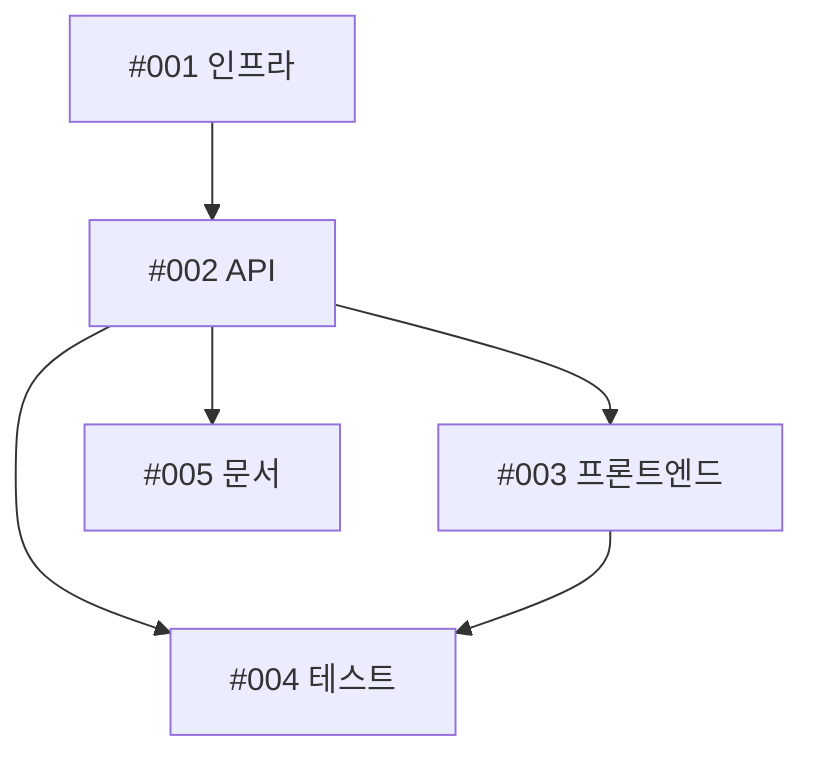

# [에픽/기능] 메인 기능 제목

## 📋 요약
이 에픽/기능이 해결하고자 하는 내용을 간략히 설명합니다.

## 🎯 문제 정의
어떤 문제를 해결하려는 것인가? 왜 중요한가?

## 💡 제안하는 해결 방안
제안하는 기능 또는 수정 사항에 대한 개괄적인 설명.

## 🔧 작업 분류 및 담당자 배정

### 하위 이슈 개요
| 이슈 | 제목                               | 담당자/에이전트        | 스토리 포인트 | 우선순위 | 의존성     | 완료    |
| ---- | ---------------------------------- | ---------------------- | ------------- | -------- | ---------- | ------- |
| #001 | [컴포넌트 A] 인프라 구축           | @cloud-architect       | 5             | 높음     | 없음       | [ ]     |
| #002 | [컴포넌트 B] API 구현              | @backend-architect     | 8             | 높음     | #001       | [ ]     |
| #003 | [컴포넌트 C] 프론트엔드 연동       | @frontend-developer    | 5             | 중간     | #002       | [ ]     |
| #004 | [테스트] 단위 테스트               | @test-automator        | 3             | 중간     | #002, #003 | [ ]     |
| #005 | [문서] API 문서화                  | @api-documenter        | 2             | 낮음     | #002       | [ ]     |

> **📝 상태 업데이트 안내:**
> 하위 이슈가 완료되면, 이 이슈의 설명을 편집하여 위 표의 "완료" 열에 해당하는 체크박스를 `[x]`로 체크하세요.
> 댓글로 상태 업데이트를 **하지 마세요**. 모든 진행 상황은 이 단일 테이블에서 관리하여 단일 진실 공급원(Single Source of Truth)을 유지합니다.

**총 스토리 포인트**: 23

### 담당자 배정 및 전문 분야
| 담당자             | 전문 분야               | 배정된 작업 | 총 포인트 | 스킬/도구 |
| ------------------ | ----------------------- | ----------- | --------- | --------- |
| @cloud-architect   | 인프라 & DevOps         | #001        | 5         | -         |
| @backend-architect | API & 백엔드 시스템     | #002        | 8         | -         |
| @frontend-developer| UI/UX & 클라이언트      | #003        | 5         | -         |
| @test-automator    | 품질 & 테스트           | #004        | 3         | -         |
| @api-documenter    | 문서화                  | #005        | 2         | -         |

### Claude Code 스킬 및 도구
**사용할 기존 스킬:**
- _`~/.claude/skills/`에서 적용 가능한 스킬과 사용 사례 나열_

**권장 신규 스킬:**
- _커스텀 스킬 생성이 필요한 도메인 특화 작업 식별_
- _예시: "복잡한 파생상품 가격 책정을 위한 금융 리스크 계산 스킬"_

### 의존성 그래프

### 통합 지점
- **#001 (@cloud-architect) → #002 (@backend-architect)**: 인프라 엔드포인트 및 연결 설정
- **#002 (@backend-architect) → #003 (@frontend-developer)**: REST API 계약 및 응답 형식
- **#002 & #003 → #004 (@test-automator)**: 통합 테스트 시나리오 및 E2E 플로우
- **#002 (@backend-architect) → #005 (@api-documenter)**: API 명세 및 사용 예시

## ✅ 인수 조건

- [ ] 모든 하위 이슈 완료 및 병합
- [ ] 모든 컴포넌트에 대한 통합 테스트 통과
- [ ] 문서 작성 완료 및 검토
- [ ] 코드 리뷰 완료
- [ ] 기존 기능에 대한 호환성 유지 (Breaking Change 없음)
- [ ] 성능 벤치마크 요구사항 충족

## 📎 추가 정보

### 관련 이슈
- #[관련_이슈_번호] - [설명]

### 참고 자료
- [설계 문서](링크)
- [API 명세](링크)
- [프로토타입](링크)

### 스크린샷/목업
_해당되는 경우 시각적 참고 자료 추가_

## 🏷️ 라벨
`epic`, `feature`, `needs-breakdown`

## 📅 일정
- **시작일**: [날짜]
- **목표 완료일**: [날짜]
- **예상 소요**: [X 스토리 포인트]

## 👥 팀
- **담당자**: @username
- **참여자**: @user1, @user2, @user3
- **리뷰어**: @reviewer1, @reviewer2
