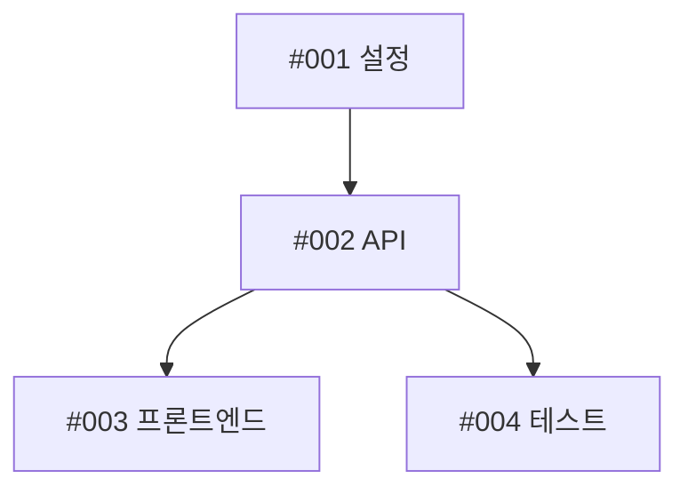

# GitHub 템플릿 가이드

Claude Code 슬래시 명령에서 사용하는 GitHub 이슈 및 풀 리퀘스트 템플릿 모음입니다.

## 목차

- [개요](#개요)
- [템플릿](#템플릿)
  - [GH_PARENT_ISSUE_TEMPLATE.md](#gh_parent_issue_templatemd)
  - [GH_SUB_ISSUE_TEMPLATE.md](#gh_sub_issue_templatemd)
  - [GH_PR_TEMPLATE.md](#gh_pr_templatemd)
  - [GH_USER_STORY_TEMPLATE.md](#gh_user_story_templatemd)
- [사용법](#사용법)
- [모범 사례](#모범-사례)

---

## 개요

이 템플릿들은 GitHub 이슈와 풀 리퀘스트에 대한 표준화된 구조를 제공하여, 프로젝트 전반에 걸쳐 일관성, 완전성, 효과적인 협업을 보장합니다.

**주요 기능:**
- 피보나치 수열을 사용한 스토리 포인트 추정
- 에이전트/팀 담당자 배정 추적
- 의존성 매핑 및 통합 지점
- 단일 진실 공급원(SSOT)을 통한 진행 상황 추적
- 사용자 스토리용 BDD/Gherkin 문법
- 시맨틱 버저닝 적용
- 포괄적인 인수 조건

**사용하는 명령:**
- `/issue` - 상위 이슈 및 하위 이슈 생성
- `/pr` - 풀 리퀘스트 생성
- `/user-story` - BDD 사용자 스토리 생성

---

## 템플릿

### GH_PARENT_ISSUE_TEMPLATE.md

**용도:** 작업 분류 및 하위 이슈 추적이 포함된 상위 이슈/에픽 템플릿.

**파일:** `~/.claude/templates/GH_PARENT_ISSUE_TEMPLATE.md`

**사용 명령:** `/issue`

**구조:**

```markdown
# [에픽/기능] 메인 기능 제목

## 📋 요약
에픽/기능에 대한 간략한 설명

## 🎯 문제 정의
어떤 문제를 해결하며 왜 중요한가?

## 💡 제안하는 해결 방안
접근 방식에 대한 개괄적 설명

## 🔧 작업 분류 및 담당자 배정
진행 상황 추적이 포함된 하위 이슈 테이블

## ✅ 인수 조건
전체 완료 기준

## 📎 추가 정보
관련 이슈, 참고 자료, 스크린샷
```

**주요 기능:**

1. **하위 이슈 개요 테이블**
   ```markdown
   | 이슈 | 제목 | 담당자/에이전트 | 스토리 포인트 | 우선순위 | 의존성 | 완료 |
   | ---- | ---- | --------------- | ------------- | -------- | ------ | ---- |
   | #001 | ...  | @agent-name     | 5             | 높음     | 없음   | [ ]  |
   ```
   - "완료" 열의 체크박스 `[x]`로 진행 상황 추적
   - 단일 진실 공급원 (댓글 업데이트 금지)

2. **담당자 배정 및 전문 분야**
   - 에이전트를 전문 분야에 매핑
   - 에이전트별 총 스토리 포인트
   - 스킬/도구 요구사항

3. **Claude Code 스킬 및 도구**
   - `~/.claude/skills/`에서 적용 가능한 기존 스킬 나열
   - 도메인 특화 작업을 위한 신규 커스텀 스킬 권장

4. **의존성 그래프**
   - 작업 의존성을 보여주는 Mermaid 다이어그램
   - 워크플로우의 시각적 표현

5. **통합 지점**
   - 에이전트/팀 간 핸드오프 정의
   - 인터페이스 및 데이터 형식 명세

**스토리 포인트:**
- 피보나치 수열 사용: 1, 2, 3, 5, 8, 13, 21
- 시간이 아닌 복잡성과 노력을 나타냄
- 추정 목적으로 합산

**사용 예시:**
```bash
/issue Stripe 결제 연동 구현
```

**출력:** 하위 작업 테이블, 의존성 그래프, 담당자 배정이 포함된 상위 이슈 생성.

---

### GH_SUB_ISSUE_TEMPLATE.md

**용도:** 개별 컴포넌트를 위한 상세 하위 이슈/작업 템플릿.

**파일:** `~/.claude/templates/GH_SUB_ISSUE_TEMPLATE.md`

**사용 명령:** `/issue` (하위 작업에 자동 적용)

**구조:**

```markdown
# [하위 이슈] 컴포넌트/모듈명

## 🔗 상위 이슈
상위 에픽 링크

## 👤 담당자 정보
전문 분야가 포함된 에이전트/팀원

## 🛠️ 스킬 및 도구
Claude Code 스킬 및 커스텀 스킬 필요 여부

## 📋 요약 및 범위
포함 범위와 제외 범위

## 🔧 기술 상세
구현 방법 및 인터페이스

## ✅ 인수 조건
구체적인 완료 요구사항

## 🧪 테스트 전략
단위 및 통합 테스트 요구사항

## 🤝 핸드오프 체크리스트
의존 팀/에이전트를 위한 요구사항
```

**주요 기능:**

1. **담당자 정보 섹션**
   - 담당 에이전트/팀원
   - 전문 분야 (예: backend-architect, frontend-developer)
   - 피보나치 스토리 포인트

2. **스킬 및 도구**
   - `~/.claude/skills/`의 Claude Code 스킬
   - 커스텀 스킬 요구사항
   - 사용 유형: 단독, 에이전트 연계, 또는 둘 다

3. **범위 정의**
   - 포함 범위: 구체적인 기능
   - 제외 범위: 다른 곳에서 처리하는 내용

4. **인터페이스 정의**
   ```yaml
   inputs:
     - parameter1: 타입, 설명
   outputs:
     - result1: 타입, 설명
   ```

5. **통합 지점**
   - 입력 받는 곳: 상위 컴포넌트
   - 출력 제공하는 곳: 하위 컴포넌트

6. **핸드오프 체크리스트**
   - 인터페이스 계약 문서화
   - API/메서드 문서화
   - 데이터 모델/스키마
   - 에러 핸들링 패턴
   - 통합 검증

**사용 예시:**
각 하위 작업에 대해 `/issue` 명령으로 자동 생성됩니다.

---

### GH_PR_TEMPLATE.md

**용도:** 변경 분류가 포함된 포괄적인 풀 리퀘스트 템플릿.

**파일:** `~/.claude/templates/GH_PR_TEMPLATE.md`

**사용 명령:** `/pr`

**구조:**

```markdown
## 요약
변경 사항에 대한 간결한 설명

## 배경 및 목적
이 변경이 필요한 이유

## 변경 유형
변경 분류 체크리스트

## 변경 내용
추가된 것/변경된 것/수정된 것/제거된 것

## 기술 상세
아키텍처, 데이터베이스, API, 설정 변경

## 테스트
테스트 커버리지 및 증거
```

**변경 유형:**
- 🐛 버그 수정
- ✨ 신규 기능
- 💥 Breaking Change
- 📝 문서
- 🎨 스타일
- ♻️ 리팩토링
- ⚡ 성능
- ✅ 테스트
- 🔧 빌드
- 🚀 CI/CD
- 🔨 기타
- ⏪ 되돌리기

**주요 기능:**

1. **유형 분류**
   - PR 유형당 단일 체크박스
   - 리뷰어가 의도를 파악하는 데 도움

2. **기술 상세 분류**
   - 아키텍처 변경
   - 데이터베이스 마이그레이션
   - API 수정
   - 설정 변경

3. **테스트 증거**
   - 단위/통합/E2E 커버리지
   - 테스트 출력 및 커버리지 리포트
   - 수동 테스트 문서화

**사용 예시:**
```bash
/pr feat(auth): Google 및 GitHub 제공자로 OAuth2 구현
```

**출력:** 저장소 분석, 변경 분류, 포괄적인 문서가 포함된 완전한 PR.

---

### GH_USER_STORY_TEMPLATE.md

**용도:** Gherkin 문법과 시맨틱 버저닝이 포함된 BDD 사용자 스토리 템플릿.

**파일:** `~/.claude/templates/GH_USER_STORY_TEMPLATE.md`

**사용 명령:** `/user-story`

**구조:**

```markdown
# 사용자 스토리: [기능명]

## 스토리 개요
~로서/~하고 싶다/~를 얻을 수 있다 형식

## 버전 정보
변경 유형이 포함된 시맨틱 버전

## 인수 조건
Gherkin 시나리오 (Given/When/Then)

## 비즈니스 맥락
문제, 영향, 가치

## 기술적 맥락
의존성, 통합, 데이터 요구사항

## 디자인 & UX
UI/UX 고려사항 및 접근성

## 테스트 전략
테스트 시나리오 및 성능 기준

## 완료 정의
완료 체크리스트

## 추가 정보
관련 스토리 및 참고 자료
```

**주요 기능:**

1. **스토리 형식**
   ```
   [사용자 유형]으로서
   [목표]를 하고 싶다
   그래서 [이점]을 얻을 수 있다
   ```

2. **버전 정보**
   - 시맨틱 버전 (X.Y.Z 형식)
   - 변경 유형 분류
   - 버전 배지: `[]()`
   - 버전 영향 설명

3. **시맨틱 버저닝**
   - **Major (X.0.0)**: Breaking change
   - **Minor (0.X.0)**: 신규 기능 (하위 호환)
   - **Patch (0.0.X)**: 버그 수정

4. **Gherkin 시나리오**
   ```gherkin
   Feature: [기능명]

     Scenario: [시나리오명]
       Given [전제조건]
       And [추가 맥락]
       When [행동]
       And [추가 행동]
       Then [예상 결과]
       And [추가 검증]
   ```

5. **다양한 시나리오 유형**
   - 주요 정상 경로
   - 대안 경로
   - 오류/엣지 케이스
   - E2E 테스트 시나리오

6. **비즈니스 맥락**
   - 우선순위 (높음/중간/낮음)
   - 대상 사용자
   - 예상 사용 빈도
   - 정량화된 비즈니스 가치

7. **접근성 요구사항**
   - 키보드 네비게이션
   - 스크린 리더 지원
   - WCAG 2.1 준수 레벨

8. **성능 기준**
   - 응답 시간 목표
   - 처리량 요구사항
   - 데이터 볼륨 처리

9. **완료 정의**
   - 포괄적인 체크리스트
   - 코드 리뷰
   - 테스트 커버리지 (>80%)
   - 문서화
   - 보안 리뷰
   - 제품 담당자 승인

**사용 예시:**
```bash
/user-story 실시간 분석이 포함된 관리자 대시보드 생성
```

**출력:** Gherkin 시나리오, 버전 정보, GitHub Projects 연동이 포함된 완전한 BDD 사용자 스토리.

---

## 사용법

### 템플릿 위치

모든 템플릿은 `~/.claude/templates/`에 저장됩니다:
```
~/.claude/templates/
├── GH_PARENT_ISSUE_TEMPLATE.md
├── GH_SUB_ISSUE_TEMPLATE.md
├── GH_PR_TEMPLATE.md
└── GH_USER_STORY_TEMPLATE.md
```

### 템플릿 로드

명령은 필요한 템플릿을 자동으로 로드합니다:

**이슈 생성:**
```bash
/issue 사용자 인증 구현
# 로드: GH_PARENT_ISSUE_TEMPLATE.md + GH_SUB_ISSUE_TEMPLATE.md
```

**PR 생성:**
```bash
/pr OAuth2 인증 추가
# 로드: GH_PR_TEMPLATE.md
```

**사용자 스토리 생성:**
```bash
/user-story 관리자 분석 대시보드
# 로드: GH_USER_STORY_TEMPLATE.md
```

### 커스터마이징

특정 프로젝트 요구에 맞게 템플릿을 커스터마이징할 수 있습니다:

1. 프로젝트 `.github/` 디렉토리에 템플릿 복사
2. 필요에 따라 섹션 수정
3. 명령은 프로젝트별 템플릿을 먼저 감지하여 사용

**예시:**
```bash
# 프로젝트별 PR 템플릿
.github/pull_request_template.md

# 명령이 자동으로 프로젝트 템플릿 사용
/pr 새 기능 추가
```

---

## 모범 사례

### 스토리 포인트

**피보나치 수열 사용:**
- 1: 사소한 작업 (몇 분)
- 2: 간단한 작업 (< 1시간)
- 3: 적당한 작업 (몇 시간)
- 5: 복잡한 작업 (반나절)
- 8: 매우 복잡한 작업 (하루)
- 13: 에픽급 작업 (며칠)
- 21: 대규모 에픽 (일주일+)

**시간 기반 추정 금지:**
- ❌ "2시간", "3일"
- ✅ "5 스토리 포인트"

### 진행 상황 추적

**상위 이슈 설명 업데이트:**
```markdown
| 이슈 | 제목 | 담당자 | 포인트 | 우선순위 | 의존성 | 완료 |
| ---- | ---- | ------ | ------ | -------- | ------ | ---- |
| #001 | 설정 | @dev1  | 5      | 높음     | 없음   | [x]  |
| #002 | API  | @dev2  | 8      | 높음     | #001   | [ ]  |
```

**댓글 사용 금지:**
- 댓글은 토론용
- 설명이 단일 진실 공급원
- 체크박스 `[x]`로 진행 상황 표시

### 의존성

**의존성 명확히 매핑:**
```markdown
의존성:
- 차단함: #123, #124
- 차단됨: #100, #101
- 외부: Stripe API v2, AWS S3
```

**의존성 그래프 생성:**


### 통합 지점

**명확한 인터페이스 정의:**
```markdown
통합 지점:
- #001 → #002: REST API 엔드포인트, JSON 응답 형식
- #002 → #003: GraphQL 스키마, WebSocket 이벤트
- #002 & #003 → #004: E2E 테스트 시나리오, 목 데이터
```

### Gherkin 문법

**모범 사례 준수:**

✅ **좋은 예:**
```gherkin
Given 관리자로 로그인되어 있고
When 설정 페이지로 이동하면
Then "사용자 관리" 섹션이 보여야 한다
```

❌ **나쁜 예:**
```gherkin
Given 관리자 로그인됨
When 설정 이동
Then 사용자 관련 보임
```

**적절한 키워드 사용:**
- `Given`: 전제조건/맥락
- `When`: 행동/이벤트
- `Then`: 예상 결과
- `And`: 추가 단계
- `But`: 부정 단언

### 시맨틱 버저닝

**버전 증가 올바르게 선택:**

**Major (Breaking):**
```
v1.5.2 → v2.0.0
- 지원 중단된 API 엔드포인트 제거
- 인증 방식 변경
- 데이터베이스 스키마 재구조화
```

**Minor (기능):**
```
v1.5.2 → v1.6.0
- 새 대시보드 위젯 추가
- PDF 내보내기 기능 도입
- 필터가 포함된 검색 강화
```

**Patch (수정):**
```
v1.5.2 → v1.5.3
- 로그인 리다이렉트 버그 수정
- 오류 메시지 오타 수정
- 메모리 누수 해결
```

### Claude Code 스킬

**작업에 스킬 매핑:**
```markdown
사용할 기존 스킬:
- 3D 시각화용 `webgl-expert` (#003)
- CZI 플랫폼 설정용 `argus-deployment` (#001)
- 리서치 단계용 `secure-web-search` (#000)

권장 신규 스킬:
- 파생상품 가격 책정용 "financial-risk-modeling" 스킬 생성 (#002)
- 의료기기 검증용 "fda-compliance-check" 스킬 생성 (#004)
```

### 접근성

**항상 포함:**
- 키보드 네비게이션 요구사항
- 스크린 리더 호환성
- WCAG 준수 레벨 (A/AA/AAA)
- 색상 대비 요구사항
- 포커스 관리

### 테스트 전략

**모든 레벨 커버:**
1. **단위 테스트**: 개별 함수/메서드
2. **통합 테스트**: 컴포넌트 상호작용
3. **E2E 테스트**: 완전한 사용자 워크플로우
4. **성능 테스트**: 부하 및 스트레스 테스트
5. **보안 테스트**: 취약점 스캐닝

### 문서화

**동시에 업데이트:**
- API 문서
- README 파일
- 아키텍처 다이어그램
- 배포 가이드
- 사용자 매뉴얼

---

## 관련 문서

- **명령:** `~/.claude/commands/README.md`
- **스킬:** `~/.claude/skills/README.md`
- **에이전트:** `~/.claude/agents/README.md`
- **GitHub CLI:** `gh help`
